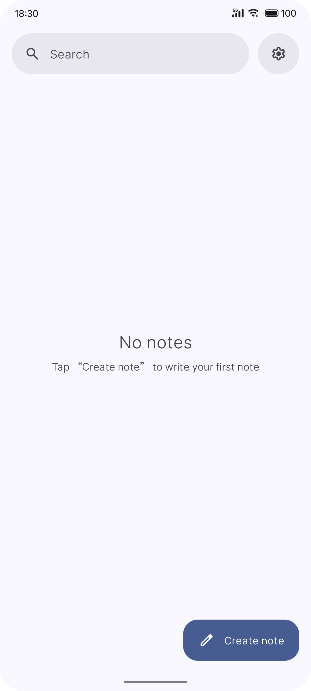
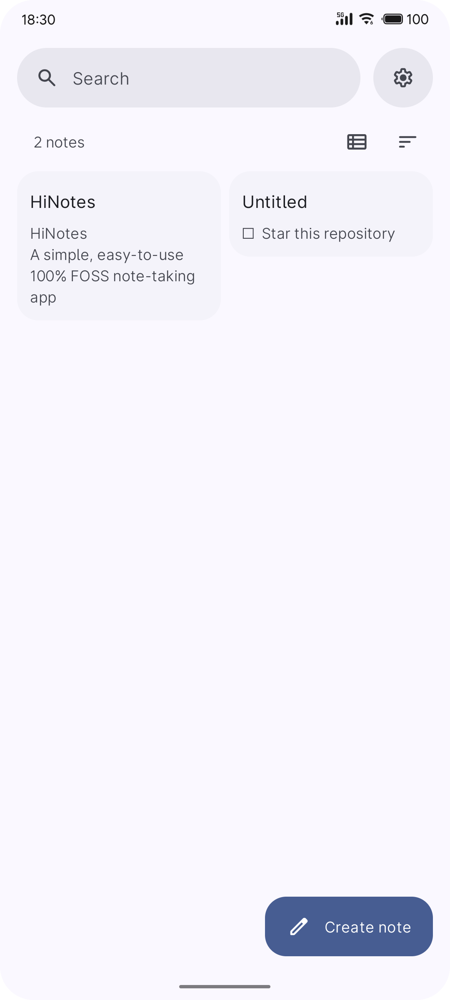
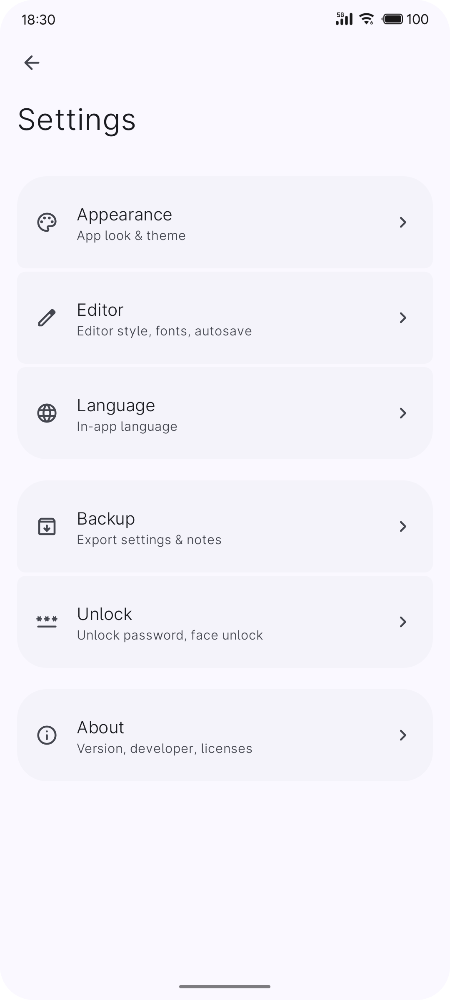
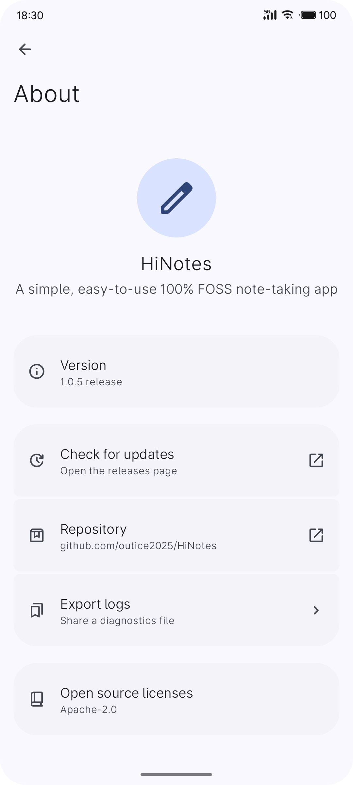

<a id="user-content-hinotes"></a>

<div align="center">
    
</div>

<div align="center">
    <h1>HiNotes</h1>
    <p>简单易用的 100% FOSS 笔记应用</p>
    <p>A simple, easy-to-use 100% FOSS note-taking app</p>
    <p><a href="#user-content-english">English</a> · <a href="#user-content-简体中文">简体中文</a></p>
</div>

---

<details>
<summary><b>Screenshots</b> · 截图</summary>

| Home | Notes | Settings | About |
| :---: | :---: | :---: | :---: |
|  |  |  |  |
| Empty state · 空状态 | List and grid · 列表与网格 | Settings · 设置 | About · 关于 |

</details>

---

## English

A simple, easy-to-use 100% FOSS note-taking app for Android, built with Jetpack Compose and
Material 3 Expressive.

Local-first: notes live in SQLite on the device, settings in DataStore. The app asks for no
INTERNET permission.

### Features

**Notes**
- Create, edit and delete notes.
- Search titles and bodies; sort by updated, created or title.
- A single-column list or a two-column staggered grid on the home screen.
- Write notes in Markdown.
- Long-press to select several notes and delete them together.
- Share a note as text or as a Markdown attachment.
- Notes can be locked to keep them from being deleted.

**Editor**
- Markdown source editing and find in note.
- Preview a note as Markdown.
- Autosave.
- A properties sheet with the note's length and its created / modified times.

**Appearance**
- Seven Material 3 colour schemes.
- Wallpaper-derived dynamic colour.
- OLED dark, and app-wide font size and weight.

**Backup**
- Export and import settings files and note files.
- Restore defaults.
- Export a diagnostics report.

**Unlock**
- Password protection with PBKDF2-HMAC-SHA1.

**Language**
- English and Simplified Chinese.

### Building

JDK 17+ and an Android SDK with platform 37 and build-tools 36+.

```bash
./gradlew :app:assembleDebug      # debug
./gradlew :app:assembleRelease    # release; signed when keystore.properties exists
```

`local.properties` must point at your SDK:

```properties
sdk.dir=/path/to/AndroidSDK
```

### Release signing

`app/build.gradle.kts` reads `keystore.properties` from the project root (git-ignored):

```properties
storeFile=keystore/release.jks
storePassword=…
keyAlias=…
keyPassword=…
```

Without that file the release variant builds unsigned instead of failing. Each release is also
copied to `releases/v<version>/`, outside `build/`, so a `clean` cannot destroy the previous
deliverable.

### Layout

```
app/src/main/java/com/hiapps/hinotes/
├── MainActivity.kt      single activity, edge-to-edge, theme wiring
├── data/                notes, SQLite store, archive, settings, lock, biometrics
└── ui/                  navigation, view model, lock gate, components, screens, theme
```

`tools/` holds the generators for the app icon, the symbol vectors and the accent palettes;
`tools/verify/` holds the checks:

```bash
pwsh -File tools/verify/run.ps1          # archive round trip and Markdown verbs, on a JVM
python tools/verify/audit_resources.py   # string, symbol and drawable references
python tools/verify/check_icon_geometry.py
```

### Privacy

- No analytics, no tracking, no accounts.
- Notes and settings stay on the device.
- The app makes no network request of its own.

### Licence

Apache License 2.0.

---

## 简体中文

简单易用的 100% FOSS Android 笔记应用，使用 Jetpack Compose 与 Material 3 Expressive 构建。

本地优先：笔记存在设备的 SQLite 中，设置存在 DataStore 中。应用不申请 INTERNET 权限。

### 功能

**笔记**
- 新建、编辑、删除笔记。
- 按标题与正文搜索；按最近修改、创建时间或标题排序。
- 首页支持单列列表或两列瀑布流网格。
- 支持以 Markdown 格式书写笔记。
- 长按进入多选，可批量删除。
- 笔记可分享为文本或 Markdown 附件。
- 可锁定笔记，防止删除。

**编辑器**
- 支持 Markdown 源码编辑、笔记内查找。
- 支持以 Markdown 格式预览笔记。
- 支持自动保存笔记。
- 属性面板显示笔记字数与创建、修改时间。

**外观**
- 包含 7 种 Material 3 配色方案。
- 支持壁纸动态取色。
- 支持 OLED 深色模式与应用级字体大小、字重。

**备份**
- 可导出/导入设置文件、笔记文件。
- 可恢复默认设置。
- 可导出诊断报告。

**解锁**
- 使用 PBKDF2-HMAC-SHA1 的密码保护。

**语言**
- 支持英文与简体中文。

### 构建

需要 JDK 17+，以及包含 platform 37 与 build-tools 36+ 的 Android SDK。

```bash
./gradlew :app:assembleDebug      # 调试版
./gradlew :app:assembleRelease    # 发布版；存在 keystore.properties 时自动签名
```

`local.properties` 必须指向你的 SDK：

```properties
sdk.dir=/path/to/AndroidSDK
```

### Release 签名

`app/build.gradle.kts` 会读取项目根目录下的 `keystore.properties`（已被 gitignore）：

```properties
storeFile=keystore/release.jks
storePassword=…
keyAlias=…
keyPassword=…
```

缺少该文件时 release 变体会构建为未签名版本，而不是直接失败。每次发布还会把 APK 复制到
`build/` 之外的 `releases/v<版本号>/`，因此 `clean` 不会毁掉上一版交付物。

### 目录结构

```
app/src/main/java/com/hiapps/hinotes/
├── MainActivity.kt      单 Activity，边到边，主题装配
├── data/                笔记、SQLite 存储、归档、设置、密码存储、生物识别
└── ui/                  路由、ViewModel、锁屏、组件、屏幕、主题
```

`tools/` 存放应用图标、符号矢量图与强调色配色的生成脚本；`tools/verify/` 存放检查：

```bash
pwsh -File tools/verify/run.ps1          # 归档往返与 Markdown 动词，在 JVM 上执行
python tools/verify/audit_resources.py   # 字符串、图标、矢量图引用审计
python tools/verify/check_icon_geometry.py
```

### 隐私

- 无统计、无追踪、无账号。
- 笔记与设置都留在设备上。
- 应用不发起任何网络请求。

### 许可证

本项目采用 Apache License 2.0 。
